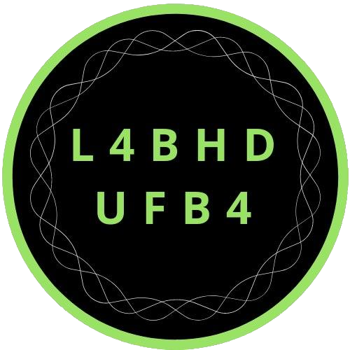
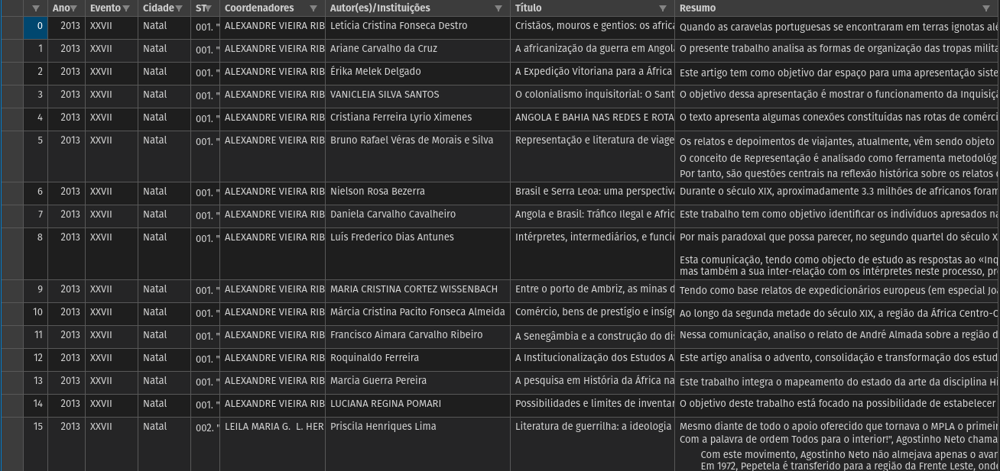

<p align="center"></p>

# anpuh-scraper
Raspador dos Resumos dos Simpósios Anuais da História da Anpuh (2013-2019)

*Raspador dos resumos dos Simpósios Nacionais de História da [Associação Nacional de História - Anpuh](https://anpuh.org.br). O programa raspa todos os resumos dos SNH 27, 28, 29 e 30, respectivamente dos anos de 2013, 2015, 2017 e 2019*
___

**A ferramenta foi desenvolvida apenas para pesquisas acadêmicas, sem fins lucrativos.**
___

Esse script foi pensado como uma ferramenta metodológica da pesquisa em humanidades
digitais. Sua criação é fruto das reflexões e experiências empíricas de historiadores e sociológos que têm enfrentado o [desafio de fazer ciências humanas no mundo digital](http://bibliotecadigital.fgv.br/ojs/index.php/reh/article/view/79933).
Defendemos a importância da apropriação, uso, desenvolvimento e aprimoramento de ferramentas digitais para as humanidades, assim como a urgência na sofisticação teórica, metodológica e epistemológica sobre as chamadas Humanidades Digitais.

É crescente o número de repositórios de fontes e dados on-line, assim como o acesso, busca, pesquisa e, muitas vezes, dependência de pesquisadores/as a eles.
Os Simpósios Nacionais da Anpuh, que acontecem bienalmente, têm reunido importantes reflexões sobre as mais variadas perspectivas historiográficas. Por conseguinte, os anais de cada evento constituem um importante repositório para pesquisas nos mais variados campos de estudo.
___

## Índice

- [anpuh-scraper](#anpuh-scraper)
  - [Índice](#índice)
  - [Instalação](#instalação)
    - [Python](#python)
      - [Bibliotecas e módulos](#bibliotecas-e-módulos)
  - [Resultados](#resultados)
  - [Licença](#licença)

---

## Instalação

Para executar o anpuh-scraper, vc precisa clonar ou fazer download do repositório e salvar na pasta em que deseja que os resultados e seus respectivos arquivos sejam armazenados. Antes de executar o script, é preciso preparar seu computador, como mostramos abaixo.

### Python

A ferramenta consiste num script escrito em [Python 3.8](https://www.python.org/). Esta é uma linguagem de programação que te permite trabalhar rapidamente e integrar diferentes sistemas com maior eficiência.
Para executar o arquivo .py é preciso instalar o Python3 em seu computador.

[Clique aqui](https://python.org.br/instalacao-windows/) para um tutorial de instalação do Python no Windows, [clique aqui](https://python.org.br/instalacao-linux/) para Linux e [clique aqui](https://python.org.br/instalacao-mac/)
para Mac.

Após a instalação, vc pode executar o arquivo .py direto do prompt de comando do Windows ou pelo terminal do Linux, ou utilizar as diversas [IDE](https://pt.wikipedia.org/wiki/Ambiente_de_desenvolvimento_integrado) disponíveis.

Exemplo de como executar utilizando o terminal do Linux, após instalar o Python3.8:

1. Acesse o diretório em que o arquivo .py está salvo:
   ```sh
   $ cd user/local
   ```
1. Instale as bibliotecas requeridas:
   ```sh
   $ pip3 install -r requirements.txt
   ```
1. Execute o arquivo usando Python3.8
   ```sh
   $ python3 resumos-snh.py
   ```


#### Bibliotecas e módulos

- **urllib.requests**: módulo do Python que ajuda a acessar urls.
[Saiba mais.](https://docs.python.org/pt-br/3/library/urllib.request.htmll)
- **bs4**: [Beautiful Soup](https://www.crummy.com/software/BeautifulSoup/bs4/doc/) é uma biblioteca Python para extrair
 dados de arquivos HTML e XML.
- **pandas**: [Pandas](https://pandas.pydata.org/) é uma biblioteca escrita em Python para manipulação e análise de dados. 

---

## Resultados

O script retorna para o usuário **um CSV (*comma-separated values*) com os dados de todos os trabalhos aceitos nos Simpósio Temáticos dos SNH 27, 28, 29 e 30**.

O CSV contém as seguintes variáveis para cada resumo:

`Ano, Evento, Cidade, ST, Coordenadores, Autor(es)/Instituições, Título, Resumo`

Esse arquivo pode ser aberto como uma planilha e trabalhado em banco de dados.



O script está funcionando perfeitamente. Qualquer alteração no site percebida pelos usuários ou sugestões de aprimoramento são bem vindas.

---

## Licença

[MIT Licence](LICENSE)

---

Autor: [Eric Brasil](https://github.com/ericbrasiln)(IHL-UNILAB), [LABHD-UFBA](http://labhd.ufba.br/)
